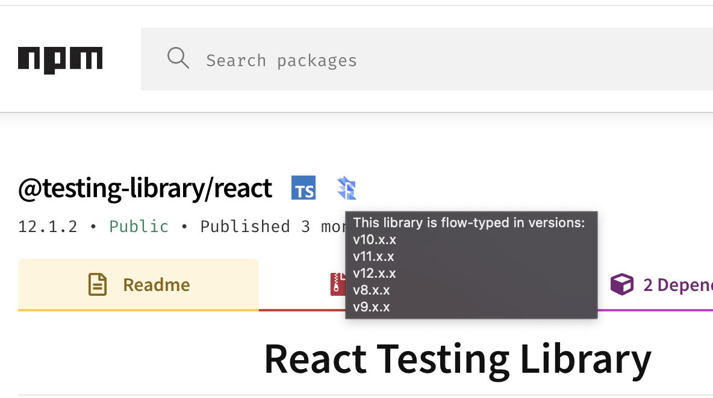

# extension-npmjs-flow-typed
Browser extension to show if a library is shipped or typed with flowtype

> Shipped with types icon is WIP



## Build

```
yarn
yarn build
```

A distribution dir will be created in `dist` along with a `dist.zip` ready to upload to the extensions store
