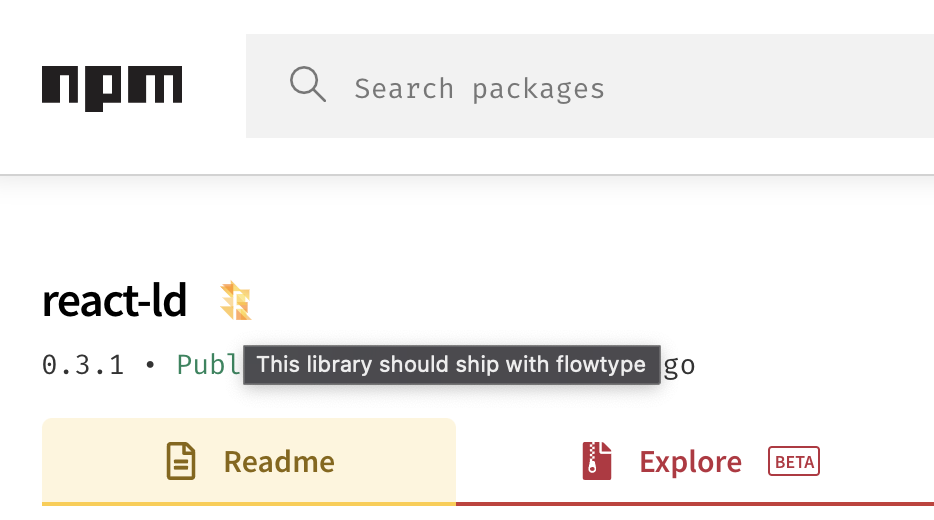

# extension-npmjs-flow-typed
Browser extension to show if a library is shipped or typed with flowtype

> Whether a library ships with flowtype is determined by whether it has appropriate dependencies to create flow definitions.
>
> Will not work if created through a mono repo or if definitions are created by other means




## Build

```
yarn
yarn build
```

A distribution dir will be created in `dist` along with a `dist.zip` ready to upload to the extensions store
